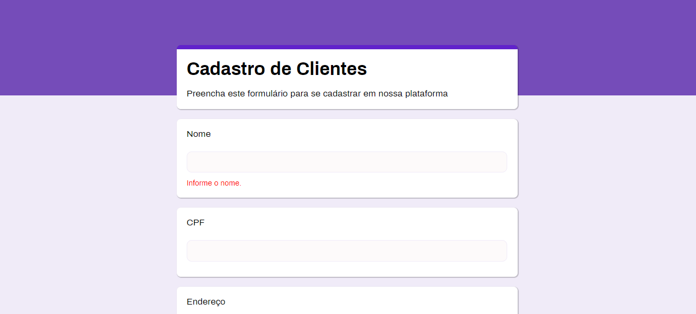

# ReliplicandoGoogleForms

## Descrição

:clipboard: Esse repositório tem como objetivo a realização de uma atividade do curso de programador web - IFBA, com o objetivo de treinar os métodos GET, POST, e a váriável superglobal FILE.
